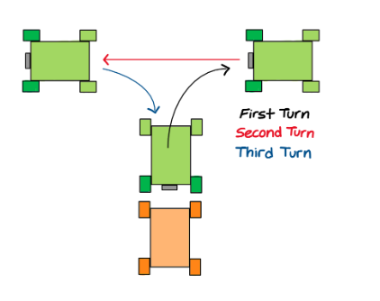

# 148-spring-2025-final-project-team-1

 
## Overview
Our final project implements a fully autonomous tow truck capable of locating, approaching, and retrieving a disabled chassis without any human intervention. At its core, the system is built as a ROS 2 package named `autonomous_tow_car`, with three coordinated nodes handling perception, maneuvering, and actuation.

## Team Members

| Name | Department |
|------|-------|
| Nicole Li | ECE |
| Shaurya Agarwal| ECE |
| Jared Admiraal | MAE | 
| George Nakoud | MAE | 

---

## Project Goals 
### Three Nodes
#### Node 1: Detect Damsel
- A forward‐facing camera continuously streams images into the Detect Damsel node.
- Inside this node, we run a lightweight computer‐vision model that scans each frame for the disabled chassis (“damsel”).
- Once a chassis is recognized, the node publishes its relative position and orientation in the car’s coordinate frame.

#### Node 2: Three Point Turn
- The Detect Damsel node’s output triggers the Three-Point Turn node. As soon as the chassis falls within a predetermined detection range, we execute the three point turn.
  - Steer Hard to Reverse: The car reverses with full‐lock steering (e.g., rear‐wheel drive at a set velocity) until the “damsel” is centered behind the rear bumper.
  - Steer Hard to Forward: It then drives forward with opposite lock to swing the front end around, aligning the car’s front wheels toward the target chassis.
  - Straighten Out & Approach: Finally, it straightens the wheels and moves forward slowly to position its front center precisely in front of the chassis, maintaining a fixed stopping distance (e.g., 0.2 m) so the towing hook can engage.
 
https://drive.google.com/file/d/1KutY3HxdIYGCIqWJ8cxIVXh8-trw-SjU/view?resourcekey

#### Node 3: Hook and Vanish
- Once the car is aligned and stopped at the ideal grabbing distance, the Hook and Vanish node takes over.
- This node commands a mini‐servo motor which lowers the hook until it contacts a designated “hook point” on the chassis, we have magnets on the hook and disabled chassis to help it attach if there are small deviations.
- Once the hook is lowered to the right position, we command the servo to retract, lifting the chassis’s eyelet snugly against the car’s frame.
- With the chassis now firmly latched, the car starts driving away.
